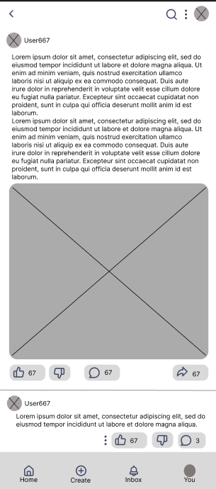
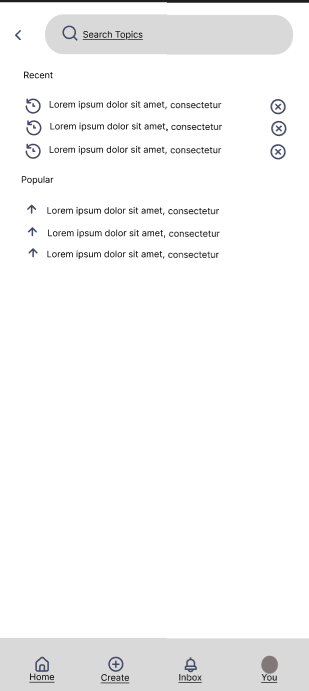
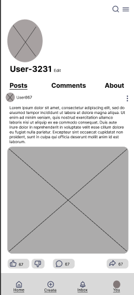

# Wireframes — KM Rationale Annotations

## 1. Home / Dashboard

**Decision:** Designed a community-style feed as the main dashboard where students can view peer posts, join discussions, and share coping strategies for mental and emotional well-being.

**Rationale:** Students dealing with mental health challenges benefit from knowing they are not alone. A shared dashboard fosters peer support by allowing students to see others' experiences, participate in discussions about school life, and discover coping strategies shared by their peers promoting a sense of community and emotional well-being.

**Alternatives considered:** A private personal dashboard showing only the 
student's own entries and stats.

**Trade-off:** A community-facing dashboard increases student engagement and peer support but requires content moderation to ensure posts remain appropriate and safe for all users.

---

## 2. Core Feature Screen

**Decision:** Designed an interactive post engagement system that allows students to comment, share, like, and dislike posts within the discussion feed.

**Rationale:** Providing interaction tools such as comments, shares, and reactions encourages active participation among students. These features create a more engaging and supportive environment where students can validate each other's experiences, respond to shared coping strategies, and amplify helpful content across the community.

**Alternatives considered:** A read-only feed where students can only view posts without any interaction, or a simplified reaction-only system with no comments.

**Trade-off:** Adding interaction features increases student engagement and community connection but introduces the need for moderation to prevent 
inappropriate comments or misuse of dislike functionality.

---

## 3. Search / Retrieve Screen

**Decision:** Designed a search screen that includes a search history log and a most searched topics section to help students quickly find relevant content and discussions.

**Rationale:** Students often revisit topics related to their mental health concerns or look for content that resonates with their current emotional state. Including search history saves time by allowing students to quickly return to previously explored content, while the most searched topics section surfaces popular and relevant discussions — helping students feel connected to shared experiences within the community specific past entries for reflection or reporting.

**Alternatives considered:** A plain search bar with no history or topic 
suggestions, or a category-based browsing system without a search function.

**Trade-off:** Displaying search history and trending topics improves 
discoverability and saves time but raises privacy considerations, as students may be sensitive about their search activity being stored or visible.

---

## 4. User Profile / Settings

**Decision:** Designed a profile screen that consolidates the student's username, own posts, comments, and recent discussion groups in one place, with quick actions for editing, deleting posts and comments, and leaving discussion communities.

**Rationale:** Students need full control over their own content and community involvement, especially in a mental health context where privacy and personal boundaries are important. Centralizing post management, comment history, and discussion group activity in the profile screen empowers students to manage their digital presence and disengage from communities that no longer serve their well-being — without navigating through multiple screens.

**Alternatives considered:** Spreading post and comment management across 
separate settings pages, or requiring students to manage their content directly from the feed without a dedicated profile view.

**Trade-off:**  Consolidating all content management into the profile screen simplifies navigation and gives students greater autonomy over their data, but may result in a more complex and content-heavy profile layout that requires careful UI organization to remain intuitive.