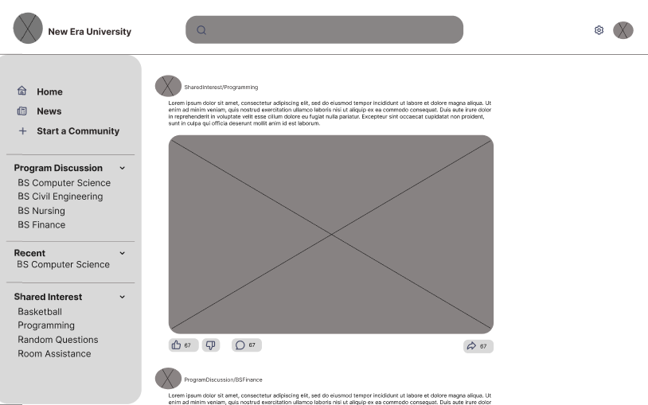
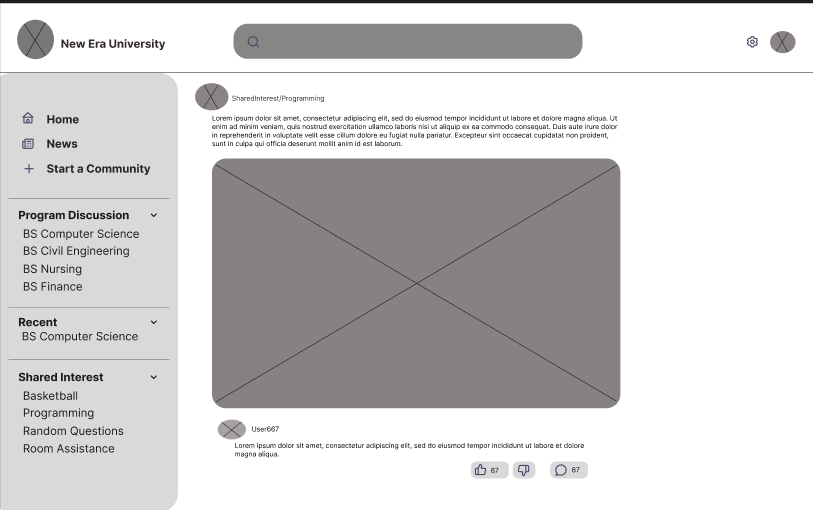
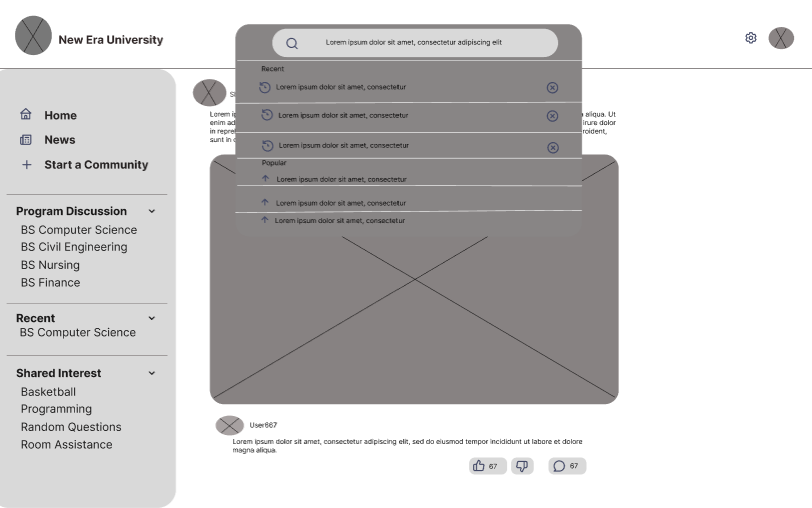
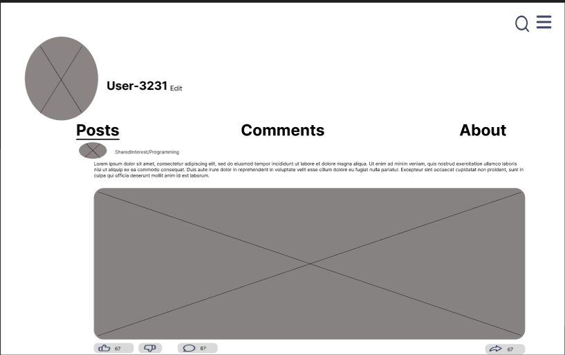

# Wireframes — KM Rationale Annotations

---

## 1. Home / Dashboard

The community-style feed presents peer posts, discussions, and coping strategies 
in a single scrollable view, eliminating the need for students to navigate across 
multiple screens to find relevant content. The left panel further reduces cognitive 
load by surfacing recommended discussions, recently visited groups, and shared 
interests upfront — so students spend less mental effort searching and more time 
engaging with content that supports their well-being.
---

## 2. Core Feature Screen

This screen supports both the Externalization and Combination modes of the 
SECI framework. Students externalize tacit knowledge by writing comments 
and sharing their own reactions to posts. The share functionality supports 
Combination by allowing students to redistribute and recombine existing 
explicit knowledge — spreading helpful coping strategies and discussions 
further across the community network.

---

## 3. Search / Retrieve Screen

The search screen reflects a two-tier knowledge taxonomy. The most searched 
topics section represents a community-generated taxonomy — organically 
shaped by collective student behavior — while the search history provides 
a personalized taxonomy based on the individual student's own 
knowledge-seeking patterns. Together they offer both broad community-level 
and narrow personal-level knowledge retrieval pathways.

---

## 4. User Profile / Settings

In a mental health KM platform, giving students ownership and control 
over their own knowledge contributions is essential for building trust 
and encouraging continued participation. A profile screen that empowers 
students to manage, update, and remove their content respects personal 
boundaries and privacy — which are critical considerations when the 
knowledge being shared is sensitive and emotionally personal in nature.
